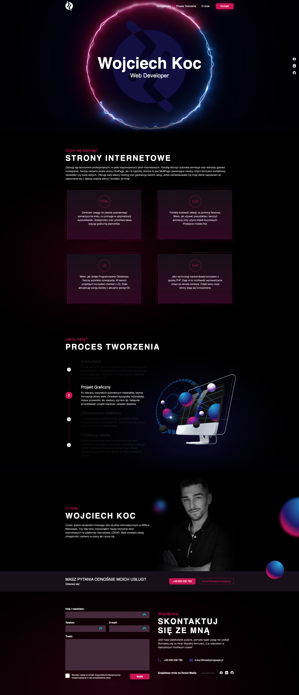
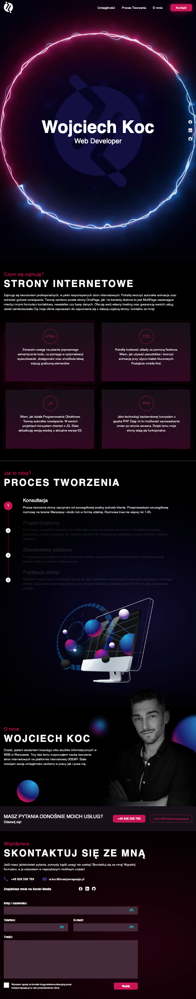
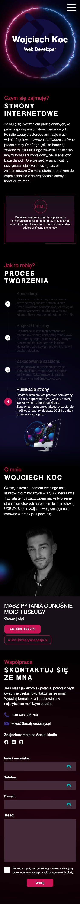

# my-business-card-website

The repository contains the source code for a graphic design that was provided by a graphic designer friend at AdobeXD. The goal of the project was to write a fully responsive business card website. The design was optimized for different devices, ensuring flexibility and visual consistency across all screens.

### Technologies used:
- HTML
- CSS
- JavaScript
- PHP

### Desktop page view

### Tablet page view

### Mobile page view

